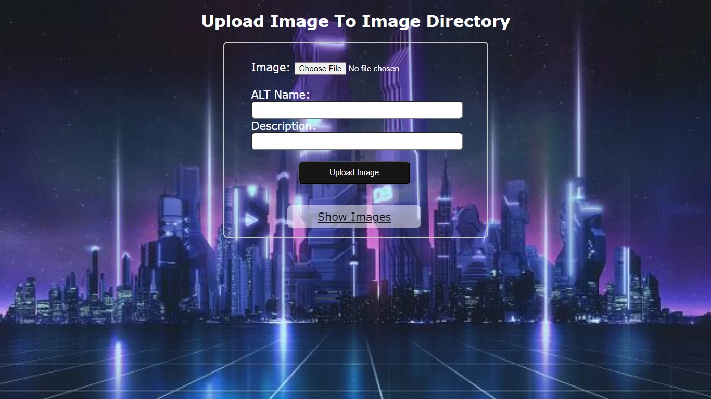
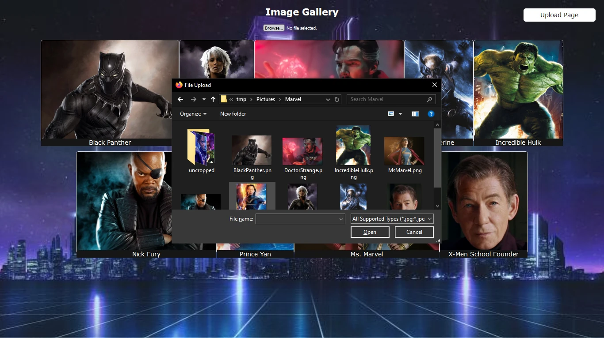

<a id="readme-top"></a>

# WebDGem Image Upload HTML
> This is the html template that is used in PHP tutorial for uploading images.

# IMPORTANT NOTE ABOUT IMAGES
The images in screenshot are from my project but are not included in this repo because they are not in public domain, although a quick search and you could find the images if you want. However, I will not be distributing the images because I am not the owner of the images and therefore do not own the right to give the images away. Instead, there are are replacement images that were all acquired from the royalty free distributer listed at the bottom of this `README.md` file.

This is the frontend design of PHP project for uploading images using a form and displaying them in a gallery. This is a simple design and was created for teaching purposes; which is why it is not complicated.

All of my designs are Vanilla because I hate using frameworks. The only time that I use a framework is if I am working on a project where someone else is using the framework. I have used Bootstrap once-upon-a-time, but found that I didn't like it and didn't need it once I learned about Flexbox.






# Table of Contents
<!-- TABLE OF CONTENTS -->
<details>
  <summary>Table of Contents</summary>
  <ol>
    <li><a href="#release-history">Release History</a></li>
    <li><a href="#installation">Installation</a></li>
    <li><a href="#meta">Meta</a></li>
    <li><a href="#license">License</a></li>
    <li><a href="#contributing">Contributing</a></li>
  </ol>
</details>

<p align="right">(<a href="#readme-top">back to top</a>)</p>


## Release History

* 0.0.1
    * Complete HTML template. You will need to know PHP to actually use it.

### Installation

1. Clone the repo
   ```sh
   git clone https://github.com/nicoleweathers/wdg_img_upload_html.git
   ```
<p align="right">(<a href="#readme-top">back to top</a>)</p>

## Meta

Nikki (WebDGem) – [@WebDGem](https://www.youtube.com/@webdgem) – YouTube channel

[https://github.com/nicoleweathers/wdg_img_upload_html](https://github.com/nicoleweathers/)

## Image Credit

All images in this file are royalty free fro Pixabay.com

## License

Distributed under the MIT License. See `LICENSE.txt` for more information.

<p align="right">(<a href="#readme-top">back to top</a>)</p>

## Contributing

Contributions are what make the open source community such an amazing place to learn, inspire, and create. Any contributions you make are **greatly appreciated**.

If you have a suggestion that would make this better, please fork the repo and create a pull request. You can also simply open an issue with the tag "suggestion".
Don't forget to give the project a star! Thanks again!

1. Fork the Project
2. Create your Feature Branch (`git checkout -b fork/YourContribution`)
3. Commit your Changes (`git commit -m 'Add some YourContribution'`)
4. Push to the Branch (`git push origin fork/YourContribution`)
5. Open a Pull Request

<p align="right">(<a href="#readme-top">back to top</a>)</p>
